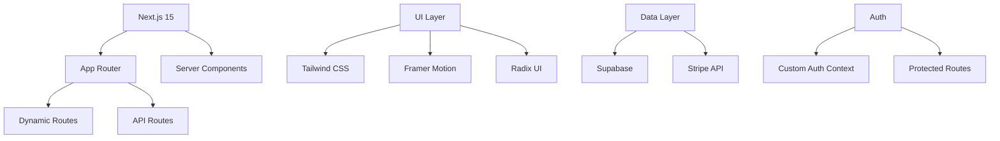

# 🐆 CHEETAH BAR - 開業チーター

<div align="center">
  
  
  <h3>Where Startup Minds Gather & Sprint</h3>
  <p>起業家の「今」と「未来」が交差する、日本最速のビジネス創造空間</p>
  
  [](https://nextjs.org/)
  [](https://www.typescriptlang.org/)
  [](https://tailwindcss.com/)
  [](https://render.com/)
</div>

<br />

## ✨ Overview

CHEETAH BARは、起業家とイノベーターのための会員制バーです。麻布十番の隠れ家的空間で、質の高いネットワーキングと特別な体験を提供します。

### 🎯 Key Features

- **🏃 Speed Networking** - 起業家同士の高速マッチング
- **🎪 Exclusive Events** - 月20回以上の限定イベント
- **🍸 Premium Experience** - シグネチャーカクテルと創作料理
- **👥 Curated Community** - 審査制による質の高いコミュニティ

<br />

## 🎨 Design System

### Color Palette

<table>
<tr>
<td align="center" style="background-color: #0077FF; color: white; padding: 20px; border-radius: 8px;">
<strong>Primary</strong><br/>
#0077FF<br/>
Cheetah Blue
</td>
<td align="center" style="background-color: #FFB800; color: black; padding: 20px; border-radius: 8px;">
<strong>Accent</strong><br/>
#FFB800<br/>
Sprint Gold
</td>
<td align="center" style="background-color: #000000; color: white; padding: 20px; border-radius: 8px;">
<strong>Background</strong><br/>
#000000<br/>
Midnight Black
</td>
<td align="center" style="background-color: #FFFFFF; color: black; padding: 20px; border-radius: 8px; border: 1px solid #e5e5e5;">
<strong>Surface</strong><br/>
#FFFFFF<br/>
Pure White
</td>
</tr>
</table>

### Typography

- **Headings**: Inter (Black/Bold) - モダンで力強い印象
- **Body**: Inter (Regular/Light) - 高い可読性
- **Japanese**: Noto Sans JP - 美しい日本語表示

### Design Principles

1. **🌙 Dark Elegance** - ダークモードファーストの洗練されたUI
2. **📱 Mobile First** - モバイル体験を最優先に設計
3. **✨ Micro Interactions** - 繊細なアニメーションで上質な体験
4. **🎯 Clear Hierarchy** - 情報の優先順位を明確に

<br />

## 📱 Mobile Experience

### 水平スクロールUI


モバイルでは革新的な水平スクロールUIを採用：
- **スナップスクロール** - 1画面ずつ確実に表示
- **ジェスチャーナビゲーション** - 直感的なスワイプ操作
- **プログレスインジケーター** - 現在位置を視覚的に表示

### レスポンシブ設計
```
📱 Mobile (< 768px)
├── 水平スクロールセクション
├── 44px以上のタッチターゲット
└── 最適化されたフォントサイズ

💻 Desktop (≥ 768px)
├── グリッドレイアウト
├── パララックススクロール
└── ホバーエフェクト
```

<br />

## 🏗️ Architecture



### Tech Stack

<table>
<tr>
<td align="center"><br /><strong>Next.js 15</strong></td>
<td align="center"><br /><strong>TypeScript</strong></td>
<td align="center"><br /><strong>Tailwind CSS</strong></td>
<td align="center"><br /><strong>React 19</strong></td>
</tr>
</table>

### Component Architecture

```typescript
// 例: プレミアムカードコンポーネント
<Card className="
  overflow-hidden 
  bg-gray-900/50 
  backdrop-blur-sm 
  border-gray-800 
  hover:border-primary/50 
  transition-all 
  duration-300 
  group
">
  <motion.div
    initial={{ opacity: 0, y: 30 }}
    whileInView={{ opacity: 1, y: 0 }}
    transition={{ duration: 0.6 }}
  >
    {/* Content */}
  </motion.div>
</Card>
```

<br />

## 🚀 Performance

<div align="center">
<table>
<tr>
<td align="center">
<h3>⚡ 95+</h3>
Lighthouse Score
</td>
<td align="center">
<h3>📱 100%</h3>
Mobile Optimized
</td>
<td align="center">
<h3>🎨 60fps</h3>
Smooth Animations
</td>
<td align="center">
<h3>🌐 <1s</h3>
First Load
</td>
</tr>
</table>
</div>

### Optimization Techniques

- **画像最適化**: Next.js Image componentとUnsplash統合
- **コード分割**: 動的インポートでバンドルサイズ削減
- **キャッシング**: 静的アセットの効率的なキャッシュ戦略
- **プリロード**: 重要なリソースの事前読み込み

<br />

## 🛠️ Development

### Setup

```bash
# Clone repository
git clone https://github.com/kazujp225/cheaterbar.git
cd cheetah-bar

# Install dependencies
pnpm install

# Setup environment variables
cp .env.example .env.local

# Run development server
pnpm dev
```

### Project Structure

```
cheetah-bar/
├── app/                    # Next.js App Router
│   ├── (routes)/          # ページルート
│   ├── api/               # APIエンドポイント
│   └── globals.css        # グローバルスタイル
├── components/            # Reactコンポーネント
│   ├── ui/               # 基本UIコンポーネント
│   └── (features)/       # 機能別コンポーネント
├── lib/                   # ユーティリティ
├── hooks/                 # カスタムフック
└── public/               # 静的アセット
```

### Scripts

```json
{
  "dev": "next dev",
  "build": "next build",
  "start": "next start",
  "lint": "next lint",
  "type-check": "tsc --noEmit"
}
```

<br />

## 🎯 Features by Page

### 🏠 Homepage
- ヒーローセクション with パララックス効果
- 水平スクロール概要（モバイル）
- メニュープレビューカルーセル
- CTAセクション

### 👤 Mypage
- ユーザープロフィール管理
- 予約履歴
- マッチング履歴
- 会員ステータス表示

### 📅 Events
- イベントカレンダー
- カテゴリーフィルター
- 予約システム統合
- 過去イベントギャラリー

### 🍸 Menu
- タブ切り替えUI
- 画像付きメニューカード
- 季節限定メニュー
- 会員限定メニュー表示

<br />

## 📊 Analytics & Monitoring

- **Vercel Analytics** - パフォーマンス監視
- **Google Analytics** - ユーザー行動分析
- **Sentry** - エラートラッキング
- **Lighthouse CI** - 継続的パフォーマンス測定

<br />

## 🤝 Contributing

1. Fork the repository
2. Create your feature branch (`git checkout -b feature/AmazingFeature`)
3. Commit your changes (`git commit -m 'Add some AmazingFeature'`)
4. Push to the branch (`git push origin feature/AmazingFeature`)
5. Open a Pull Request

<br />

## 📄 License

This project is proprietary and confidential. All rights reserved by 開業チーター.

<br />

## 🙏 Acknowledgments

- Design inspiration from premium hospitality brands
- UI components from [Radix UI](https://www.radix-ui.com/)
- Animations powered by [Framer Motion](https://www.framer.com/motion/)
- Images from [Unsplash](https://unsplash.com/)

<br />

<div align="center">
  <p>Built with ❤️ by 開業チーター</p>
  <p>
    <a href="https://cheaterbar.com">Website</a> •
    <a href="https://twitter.com/kaigyo_cheetah">Twitter</a> •
    <a href="mailto:info@cheaterbar.com">Contact</a>
  </p>
</div>